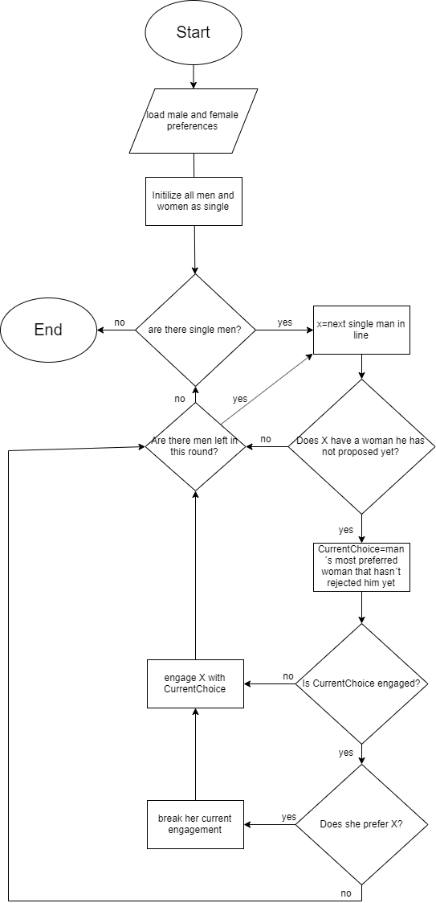

```{r setup, include=FALSE}
knitr::opts_chunk$set(echo = TRUE)
options(tinytex.verbose = TRUE)

```


## Abstract 

Goal of this paper is to focus the widely known stable marriage problem and to solve it using the R language. To do so, we use Gale-Shapley algorithm, which was introduced in 1962 by David Gale and Lloyd Shapley. The algorithm offers widespread applications in the real world, for example, in social and economic systems, labour markets etc. In this paper we briefly introduce the stable marriage problem, subsequently show how to solve it using the Gale-Shapley algorithm. For better readability of the code we also attach pseudocode and a flowchart.

## Introduction

The stable marriage problem is a problem of finding a stable matching between two equally sized sets of elements given an ordering of preferences for each element. A matching is a mapping from the elements of one set to the elements of the other set. A matching is not stable if:  

a) There is an element A of the first matched set which prefers some given element B of the second matched set over the element to which A is already matched, and 

b) B also prefers A over the element to which B is already matched. 

The stable marriage problem has been stated as follows: Given n men and n women, where each person has ranked all members of the opposite sex in order of preference, marry the men and women together such that there are no two people of opposite sex who would both rather have each other than their current partners. When there are no such pairs of people, the set of marriages is deemed stable.

## Gale-Shapley algorithm pseudocode

You can think of the algorithm as multiple iterations of proposals and rejections. In each round, all single men propose to their most preferred woman they havent't proposed to yet. If the women is a single, she accepts. If she is engaged, but prefers the new man, she breaks her current engagement and accepts to new proposal. Otherwise she stays engaged to her old partner. This cycle continues until all people are engaged. Engagements constructed in this manner are proven to be stable.

The runtime complexity of this algorithm is O(n^2) where n is the number of men or women.

```{}
function stableMatching {
    Initialize all m in M and w in W to free
    while exists free man m who still has a woman w to propose to {
       w = first woman on m's list to whom m has not yet proposed
       if w is free
         (m, w) become engaged
       else some pair (m', w) already exists
         if w prefers m to m'
            m' becomes free
           (m, w) become engaged 
         else
           (m', w) remain engaged
    }
}
```





## Example datasets

We provide three example datasets you can use to test our implementation.


```{r}
# 3 x 3 dataset
# Source and correct solution:
# https://cran.r-project.org/web/packages/matchingR/vignettes/matchingR-intro.html
# (We gave the numbers names for readability)

m1.prefs <- data.frame(Tom = c("Kate", "Ashley", "Sara"),
    Bob = c("Sara", "Kate", "Ashley"),
    Roman = c("Sara", "Ashley", "Kate"))


f1.prefs <- data.frame(Kate = c("Roman", "Bob", "Tom"),
    Ashley = c("Tom", "Roman", "Bob"),
    Sara = c("Roman", "Bob", "Tom"))

```


```{r}
# 4 x 4 dataset
# Source and correct solution: https://youtu.be/Qcv1IqHWAzg?t=346 (Numberfile)
# (Genders in our code are flipped to match the source data,
# Numberfile uses woman-proposing version of the alghorithm)

m2.prefs <- data.frame(Charlotte = c("Bingley", "Darcy", "Collins", "Whickham"),
    Elizabeth = c("Whickham", "Darcy", "Bingley", "Collins"),
    Jane = c("Bingley", "Whickham", "Darcy", "Collins"),
    Lydia = c("Bingley", "Whickham", "Darcy", "Collins"))


f2.prefs <- data.frame(Bingley = c("Jane", "Elizabeth", "Lydia", "Charlotte"),
    Collins = c("Jane", "Elizabeth", "Lydia", "Charlotte"),
    Darcy = c("Elizabeth", "Jane", "Charlotte", "Lydia"),
    Whickham = c("Lydia", "Jane", "Elizabeth", "Charlotte"))
 
```


```{r}
# 10 x 10 dataset
# Source & correct solution: https://rosettacode.org/wiki/Stable_marriage_problem

m3.prefs <- data.frame(
    abe = c("abi", "eve", "cath", "ivy", "jan", "dee", "fay", "bea", "hope", "gay"),
    bob = c("cath", "hope", "abi", "dee", "eve", "fay", "bea", "jan", "ivy", "gay"),
    col = c("hope", "eve", "abi", "dee", "bea", "fay", "ivy", "gay", "cath", "jan"),
    dan = c("ivy", "fay", "dee", "gay", "hope", "eve", "jan", "bea", "cath", "abi"),
    ed = c("jan", "dee", "bea", "cath", "fay", "eve", "abi", "ivy", "hope", "gay"),
    fred = c("bea", "abi", "dee", "gay", "eve", "ivy", "cath", "jan", "hope", "fay"),
    gav = c("gay", "eve", "ivy", "bea", "cath", "abi", "dee", "hope", "jan", "fay"),
    hal = c("abi", "eve", "hope", "fay", "ivy", "cath", "jan", "bea", "gay", "dee"),
    ian = c("hope", "cath", "dee", "gay", "bea", "abi", "fay", "ivy", "jan", "eve"),
    jon = c("abi", "fay", "jan", "gay", "eve", "bea", "dee", "cath", "ivy", "hope"))


f3.prefs <- data.frame(
    abi = c("bob", "fred", "jon", "gav", "ian", "abe", "dan", "ed", "col", "hal"),
    bea = c("bob", "abe", "col", "fred", "gav", "dan", "ian", "ed", "jon", "hal"),
    cath = c("fred", "bob", "ed", "gav", "hal", "col", "ian", "abe", "dan", "jon"),
    dee = c("fred", "jon", "col", "abe", "ian", "hal", "gav", "dan", "bob", "ed"),
    eve = c("jon", "hal", "fred", "dan", "abe", "gav", "col", "ed", "ian", "bob"),
    fay = c("bob", "abe", "ed", "ian", "jon", "dan", "fred", "gav", "col", "hal"),
    gay = c("jon", "gav", "hal", "fred", "bob", "abe", "col", "ed", "dan", "ian"),
    hope = c("gav", "jon", "bob", "abe", "ian", "dan", "hal", "ed", "col", "fred"),
    ivy = c("ian", "col", "hal", "gav", "fred", "bob", "abe", "ed", "jon", "dan"),
    jan = c("ed", "hal", "gav", "abe", "bob", "jon", "col", "ian", "fred", "dan"))
```


Picking a dataset:

```{r}
# Change this to pick a different dataset
m.prefs = m1.prefs
f.prefs = f1.prefs
```


## Implementation


```{r}
males <- colnames(m.prefs)
females <- colnames(f.prefs)

# Define the results table
# EngagedTo = Who the man is currently engaged to
# Choice index = Position of the best possible choice on the mans 
#               list of preferences = number of times the man was rejected.
m.results = as.matrix(data.frame(name = males,
                engagedTo = rep("", length(males)),
                choiceIndex = rep(1, length(males)), row.names = males))

# Iterate while there are single men
while (length(m.results[m.results[,"engagedTo"] == "",]) > 0) {
  for (x in males) {
    # only single men with unexplored options can propose
    if(m.results[x, "engagedTo"] == "" 
       && as.numeric(m.results[x, "choiceIndex"]) <= length(females)) {
      # Get preference data from tables
      choiceIndex = as.numeric(m.results[x, "choiceIndex"])
      currentChoice = as.character(m.prefs[[x]][choiceIndex])
      currentChoiceEngagement = m.results[m.results[, "engagedTo"] == currentChoice,"name"]
      
      print(paste0(x," proposes to ", currentChoice, ", their ", choiceIndex, ". choice."))
  
      if (length(currentChoiceEngagement) == 0) {
        # If choice is not engaged, she accepts the proposal
        print(paste0(currentChoice," is not engaged and accepts the proposal from ", x, "."))
        m.results[x, "engagedTo"] = currentChoice
      }
      else {
        # Check who the proposed woman prefers more and accept or reject the proposal
        proposalAccepted = 
          which(f.prefs[[currentChoice]] == x) < 
          which(f.prefs[[currentChoice]] == currentChoiceEngagement)
  
        if(proposalAccepted) {
          m.results[currentChoiceEngagement, "engagedTo"] = "";
          m.results[currentChoiceEngagement, "choiceIndex"] = 
            as.numeric(m.results[currentChoiceEngagement, "choiceIndex"]) + 1
          m.results[x, "engagedTo"] = currentChoice
          
          print(paste0(currentChoice," is engaged to ", currentChoiceEngagement, 
                       " but prefers ", x, " and accepts their proposal. ",
                       currentChoiceEngagement, " is single again."))
        } else {
          m.results[x, "choiceIndex"] = as.numeric(m.results[x, "choiceIndex"]) + 1
          print(paste0(currentChoice," is engaged to ", currentChoiceEngagement,
                       " and rejects ", x, "."))
        }
      }
      cat("\n")
    }
  }
}
```

```{r echo=FALSE}
print("Final results: ")
for(row in 1:nrow(m.results)) {
   print(paste0(m.results[row,"name"]," is married to ", m.results[row, "engagedTo"],", his ", m.results[row, "choiceIndex"],". choice."))
}
```


## Conclusion 

It is easily proven, that for two equally sized sets of elements given an ordering of preferences for each element, there is always a possibility of matching the elements together in a stable way. In general, there may be many different stable matchings. 

The Gale-Shapley algorithm in which men propose always results in a stable matching that is the best for all men among all possible stable matchings. Similarly, if the women propose then the resulting matching is the best for all women.


Sources:

* Wikipedia: https://en.wikipedia.org/wiki/Stable_marriage_problem
* Numberfile: https://www.youtube.com/watch?v=Qcv1IqHWAzg&t
* Rosetta code: https://rosettacode.org/wiki/Stable_marriage_problem
